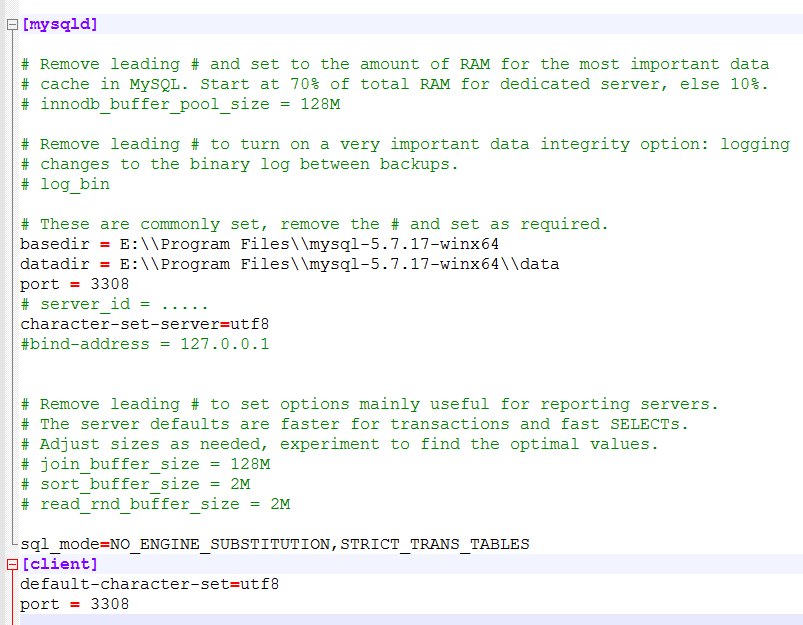

#MySQL知识点
___
####基本概念
* 数据库是保存有组织的数据容器；表是一种结构化数据结构。
* 模式：描述数据库和表的布局及特征的信息。
* 主键：一列或一组列，能够唯一区分表中的每一行。

####MySQL命令
**SHOW命令**
* 在mysql命令行中输入HELP SHOW可以显示所有的SHOW命令
* 切换数据库：USE mydatabase;
* 显示数据库：SHOW DATABASES;
* 显示数据库中的表：SHOW TABLES;
* 显示表中的列：SHOW COLUMNS FROM tbl_custom;
> 另一种快捷方式是DESCRIBE tbl_custom

**SELECT命令**
* 多条SQL语句必须以";"分隔，SQL语句不区分大小写，在处理SQL语句时其中所有空格都被忽略
* SELECT column_name1,column_name2 FROM tbl_custom;
* 通配符"\*":SELECT * FROM tbl_custom
* 检索不同的行：SELECT DISTINCT column_name1,column_name2 FROM tbl_custom;
> DISTINCT关键字必须放置于列名的前面，并且应用于所有的列
* 限制结果：SELECT column_name1 FROM tbl_custom LIMIT 5;SELECT column_name1 FROM tbl_custom LIMIT 5,5;
> LIMIT带一个参数表示从第一行开始，这个参数表示要返回的行数；带两个参数的话，第一个参数表示开始的位置，第二个参数表示要检索的行数。注意检索出来的第一行是行0
* 完全限定表名：SELECT tbl_custom.column_name1 FROM tbl_custom;

**排序检索的数据**
* 数据排序：SELECT column_name1 FROM tbl_custom ORDER BY column_name1;
通常ORDER BY中所使用的列将是为显示所选择的列，但是用非检索的列排序也是合法的。
* 多列排序：SELECT column_name1,column_name2 FROM tbl_custom ORDER BY column_name1,column_name2;
先按column_name1排序，在column_name1相同的数据中按照column_name2排序
* 指定排序方向：SELECT column_name1,column_name2 FROM tbl_custom ORDER BY column_name1 DESC,column_name2;
 先按column_name1降序排序，在column_name1相同的数据中按照column_name2排序
> DESC只作用于直接位于其前面的列
* ORDER BY和LIMIT组合使用：SELECT column_name1 FROM tbl_custom ORDER BY column_name1 LIMIT 1;
> LIMIT需要位于ORDER BY之后

**数据过滤**
* 简单过滤：SELECT column_name1 FROM tbl_custom WHERE column_name1=target;
> 在同时使用WHERE和ORDER BY的时候，ORDER BY要位于WHERE之后
> WHERE column_name1=10(column_name1为数值)；
> WHERE column_name1='target'(column_name1为字符串)
* 限定范围：SELECT column_price FROM tbl_custom WHERE column_price BETWEEN 5 AND 10;
> BETWEEN匹配范围中的所有值，包括指定的开始值和结束值
* 空值检查：SELECT cloumn_name1 FROM tbl_custom WHERE column_name1 IS NULL;
> NULL空值表示这一列不包含值
* 使用AND来表示多个过滤条件：SELECT column_name1,column_name2 FROM tbl_custom WHERE column_name1=10 AND column_name2<20;
* 使用OR来表示满足任意一个过滤条件：SELECT column_name1,column_name2 FROM tbl_custom WHERE column_name1=10 OR column_name2<20;
* AND和OR组合使用：SELECT column_name1,column_name2 FROM tbl_custom WHERE (column_name1=5 OR column_name1=6) AND column_name2=20
> 建议同时使用AND和OR时，用括号标识出计算的优先级
* IN操作符：SELECT column_name1 FROM tbl_custom WHERE column_name1 IN ('a','b','c') ORDER BY column_name1;

####MySQL的安装
1. 从oracle官网上下载Community版本的MySQL Community Server的安装zip包
2. 设置my.ini文件

3. 安装MySQL服务
> 注意：以管理员权限运行cmd
> 输入mysqld --install MySQL
> 输入mysqld --remove MySQL可以删除MySQL服务
4. 初始化data数据，下载下来的5.7.17版本的MySQL解压以后没有data文件夹，因此需要初始化data数据
> 输入mysqld  --initialize-insecure
> 在mysql的解压目录中会出现data文件夹
5. 启动MySQL服务
> 输入net start MySQL
> 输入net stop MySQL可以停止MySQl服务
> mysqladmin -u root -p password shutdown也可以停止MySQL服务
6. 登录
> 输入mysql -u root
7. 修改root用户的密码
> set password for root@localhost = password("admin");
8. 创建用户
> create user 'platform_admin'@'localhost' identified by 'weieyuan';
9. 赋予权限
> grant all no *.* to 'platfrom_admin'@'localhost';
