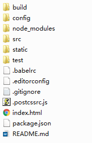

## vue-cli脚手架搭建vue工程

#### 使用模板创建项目
1.安装vue-cli

```
npm install -g vue-cli
```

2.使用模板创建vue的工程

```
vue init <template-name> <project-name>
//示例：使用webpack模板创建工程
vue init webpack myProject
```

官方给出了如下几种模板，具体可以参考vue-cli在github上的说明。
	* webpack
	* webpack-simple
	* browserify
	* browserify-simple
	* pwa
	* simple


#### 基于webpack的vue项目结构说明

1.项目结构



build目录放置的是wepack的配置文件以及在package.json中配置的npm命令所调用的脚本(build命令、dev命令等)。
config目录放置的是配置文件，主要包括生产环境和开发环境中的各种webpack配置文件中的配置项。
node_modules是依赖包的安装目录。
src是源码目录。
static用于放置静态资源，包括图片、js文件、css文件等。
test用于放置测试代码。

2.常用的npm命令

1）npm run dev
开发调试最常用的命令，该命令会"运行"该项目，并主动打开浏览器显示项目的主界面，当有文件修改时，会主动重新编译和刷新浏览器的界面

2）npm run build
用于项目的发布，该命令会编译整个项目，并生成dist目录，该目录中放置的是编译后的html文件、编译后的js文件以及依赖的静态文件。
