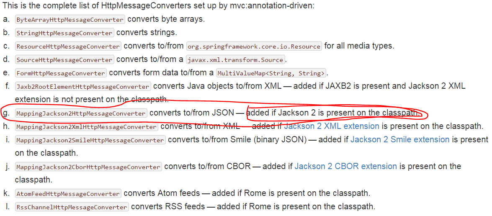

#### 基于gradle搭建SpringMVC工程
___
**1.目录结构**  
```
src
	main
		java
		resources
		webapp
			WEB-INF
				web.xml
			resources
	test
		java
		resources
build.gradle

```

**2.build.gradle**  
```
apply plugin: "java"
apply plugin: "war" //用于build时生成war包
apply plugin: "eclipse-wtp" //如果需要将工程构建为eclipse中的web工程需要使用此插件

buildscript {
	//这个插件有三个作用：1.会将工程编译成一个大的jar包；2.搜索public static void main()方法，将方法所在的类标记为可运行的类；3.根据Spring-boot的版本号自动去匹配所依赖的jar包的版本号
//    dependencies {
//        classpath("org.springframework.boot:spring-boot-gradle-plugin:1.5.1.RELEASE")
//    }
}

// 仓库地址
repositories{
	maven { url "http://10.187.181.237:8081/nexus/content/repositories" }
	maven { url "http://10.187.181.237:8081/nexus/content/repositories" }
	maven { url "http://10.187.181.237:8081/nexus/content/repositories" }
}


// 依赖的jar包
dependencies{
	compile 'org.springframework:spring-webmvc:4.3.4.RELEASE'
	compile 'javax.servlet:servlet-api:2.5'
}
```  
执行gradle build命令，在build/libs目录下生成war包
执行gradle eclipse命令，将工程构建成eclipse中的web工程

**3.web.xml**  
spring xml中的"xmlns、xsi"：  
xmlns:是XML NameSpace的缩写，因为XML文件的标签名称都是自定义的，自己写的和其他人定义的标签很有可能会重复命名，而功能却不一样，所以需要加上一个namespace来区分这个xml文件和其他的xml文件，类似于java中的package。
xsi:schemaLocation用于声明了目标名称空间的模式文档，schema就是schema~你把他翻译成对文档的限制就行了。你可能会说，dtd才是，实际上xsd和dtd是一样的 { xsd是民间的 dtd是官方的 }  
xsi全名：xml schema instance  
web-app是web.xml的根节点标签名称  
version是版本的意思  
xmlns:xsi是指web.xml遵守xml规范

```
<?xml version="1.0" encoding="UTF-8"?>
<web-app version="3.0" xmlns="http://java.sun.com/xml/ns/javaee"
		 xmlns:xsi="http://www.w3.org/2001/XMLSchema-instance"
		 xsi:schemaLocation="http://java.sun.com/xml/ns/javaee http://java.sun.com/xml/ns/javaee/web-app_3_0.xsd">
	
	<context-param>
		<!-- this xml is used to describe this context(web application), and this xml is shared by all servlets and filters -->
		<param-name>contextConfigLocation</param-name>
		<param-value>/WEB-INF/root-context.xml</param-value>
	</context-param>
	
	<servlet>
		<servlet-name>demo</servlet-name>
		<servlet-class>org.springframework.web.servlet.DispatcherServlet</servlet-class>
		<init-param>
			<param-name>contextConfigLocation</param-name>
			<!-- this xml is used to describe this servlet -->
			<param-value>/WEB-INF/servlet.xml</param-value>
		</init-param>
		<load-on-startup>1</load-on-startup>
	</servlet>
	
   <servlet-mapping>
   		<servlet-name>demo</servlet-name>
   		<url-pattern>/</url-pattern>
   </servlet-mapping>
	
</web-app>
```

**4.servlet.xml**  
```
<?xml version="1.0" encoding="UTF-8"?>
<beans xmlns="http://www.springframework.org/schema/beans"
	   xmlns:xsi="http://www.w3.org/2001/XMLSchema-instance"
	   xmlns:context="http://www.springframework.org/schema/context"
	   xmlns:mvc="http://www.springframework.org/schema/mvc"
	   xsi:schemaLocation="
	   http://www.springframework.org/schema/beans 
	   http://www.springframework.org/schema/beans/spring-beans.xsd
	   http://www.springframework.org/schema/context
       http://www.springframework.org/schema/context/spring-context.xsd
       http://www.springframework.org/schema/mvc 
       http://www.springframework.org/schema/mvc/spring-mvc.xsd">
	
	<context:component-scan base-package="com.wei"/>
	<mvc:annotation-driven />
	
	<mvc:resources mapping="/resources/**" location="/resources/" />
	
	<bean id="viewResolver"        class="org.springframework.web.servlet.view.InternalResourceViewResolver">
		<property name="prefix" value="/WEB-INF/view/"></property>
		<property name="suffix" value=".jsp"></property>
	</bean>
	
</beans>
```

**5.root-context.xml**  
```
<?xml version="1.0" encoding="UTF-8"?>
<beans xmlns="http://www.springframework.org/schema/mvc"
	   xmlns:xsi="http://www.w3.org/2001/XMLSchema-instance"
	   xmlns:beans="http://www.springframework.org/schema/beans"
	   xmlns:context="http://www.springframework.org/schema/context"
	   xsi:schemaLocation="http://www.springframework.org/schema/mvc 
	   http://www.springframework.org/schema/mvc/spring-mvc.xsd
	   http://www.springframework.org/schema/beans 
	   http://www.springframework.org/schema/beans/spring-beans.xsd
	   http://www.springframework.org/schema/context
	   http://www.springframework.org/schema/context/spring-context.xsd">
	
	
</beans>
```

#### SpringMVC搭建web系统的疑难点
**springMvc中支持json对象的转换**  
>只有在jsckson2在classpth中时，spring才会把MappingJackson2HttpMessageConverter注册为默认的消息转换
>因此需要引入com.fasterxml.jackson.core:jackson-databind:2.8.6的jar包  



