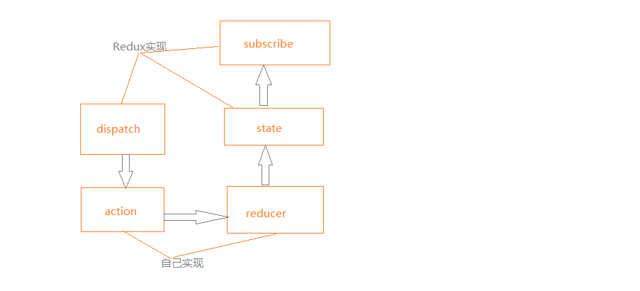

## React新的前端思维方式
create-react-app脚手架使用：    
```
npm install create-react-app -g

create-react-app prj
```

在使用JSX的范围内必须要有React。  

React判断一个元素是Html元素还是React组件的原则就是看第一个字母是否是大写。  

JSX中使用了事件委托，所有事件都被事件处理函数捕获，然后根据具体的组件分配给特定的函数。  

React渲染组件时，会对比这一次产生的Virtual DOM和上一次渲染的Virtual DOM，只更新差异部分。

## 设计高质量的React组件
props或者state的变化都可能引起组件的重新渲染。  

style属性值有两层花括号，外层表示是JSX的语法，内层表示这是一个对象常量：  
```
<Button style={{color: "red"}}/>
```

React要求render函数只能返回一个元素。  

propTypes检查，建议在开发环境中使用，在生产环境不要使用：    
```
Counter.propTypes = {
  caption: PropTypes.string
};
```

设置默认值：  
```
Counter.defaultProps = {
  caption: ""
};
```

render函数返回null或者false，表示这个组件不需要渲染任何DOM元素。  

componentDidMount被调用的时候，render函数返回的东西已经引发了渲染，组件已经被装载到了DOM树上。

componentWillMount可以在服务器端调用，也可以在浏览器端调用，componentDidMount只能在浏览器端调用。

只要父组件的render函数被调用，在render函数中被渲染的子组件就会经历更新过程，不管父组件传递给子组件的props有没有变化，都会触发子组件的componentWillReceiveProps函数。

调用forceUpdate会强制引发一次重新绘制。

应该考虑实现shouldComponentUpdate(nextProps, nextState)，返回false表示组件不需要重新渲染，返回true表示组件需要重新渲染，可以提升性能。

## 从Flux到Redux
**Flux的思想：**  


**Redux思想：**  
  


dispatch接收action参数，调用reducer生成新的state，在state变化后通知订阅者。  
reducer接收state和action参数，生成新的state。  
action描述了动作类型和传递的数据。  

createStore的简易实现：  
```
const createStore = (reducer) => {
	let state = {};
    let listeners = [];

    const getState = () => state;
    const dispatch = (action) => {
        let prevState = state;
		state = reducer(prevState, action);
        listeners.forEach((listener) => listener(state));
        return state;
    };

    const subscribe = (listener) => {
      listener.push(listener);
      return () => {
        listeners = listeners.filter((l) => l!= listener)
      }
    };

    return {
      getState,
      dispatch,
      subscribe
    };
};
```

三条规则：  

* 应用的state存储在全局唯一的state中
* state是只读的，只能通过emit一个action来修改state
* 使用纯函数来实现reducer，reducer中不要修改旧的state，返回一个新的state


